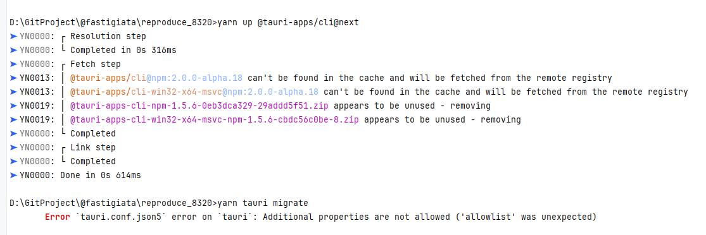

Run in the following order to reproduce

- switch to yarn@3 -- `yarn set version 3.6.4`
- install deps -- `yarn`
- upgrade `@tauri-apps/cli` -- `yarn up @tauri-apps/cli@next`
- try to migrate -- `yarn tauri migrate`

then I got this

- Temporarily delete the allowlist field in `tauri.conf.json5` and rerun `yarn tauri migrate`

